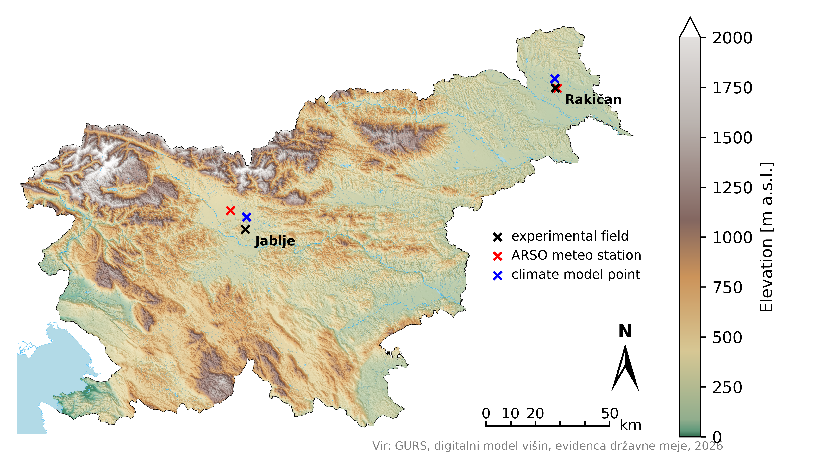

Data sources
===============

## Meteorological data

Meteorological data for the historical period was provided by the Slovenian Environmental Agency (ARSO). It was measured at the following stations:

| Field name | Field latitude | Field longitude | Field altitude [m] | Meteorological station             | ARSO station ID | Latitude | Longitude | Altitude [m] |
|------------|----------------|-----------------|--------------------|------------------------------------|-----------------|----------|-----------|--------------|
| Jablje     | 46.141         | 14.556          | 305                | Letališče Jožeta Pučnika Ljubljana | 8               | 46.211   | 14.478    | 362          |
| Rakičan    | 46.650         | 16.196          | 188                | Murska Sobota                      | 355             | 46.658   | 16.159    | 189          |

Measured data for Tmin, Tmax, and precipitation are homogenized, while ET0 is not homogenized.
The weather data files are named according to the ARSO station ID.

## Climate data 

Gridded climate data was downloaded from the Slovenian open data portal [OPSI](https://podatki.gov.si/) (search for "Podnebne spremembe: Projekcije"). Climate analysis and projections were prepared by the Slovenian Environmental Agency (ARSO).
There is one file for each GCM-RCM combination, scenario, and time period. ARSO provides projections for the following combinations:

| GCM          | RCM        | RCP2.6 | RCP4.5 | RCP8.5 |
|--------------|------------|--------|--------|--------|
| CNRM-CM5-LR  | CCLM4-8-17 |        | x      | x      |
| MPI-ESM-LR   | CCLM4-8-17 |        | x      | x      |
| EC-EARTH     | HIRHAM5    | x      | x      | x      |
| IPSL-CM5A-MR | WRF331F    |        | x      | x      |
| HadGEM2-ES   | RACMO22E   | x      | x      | x      |
| MPI-ESM-LR   | RCA4       |        | x      | x      |

## Map data

To produce the maps we used data from the Surveying and Mapping Authority of the Republic of Slovenia [GURS](https://ipi.eprostor.gov.si/jgp/data). We used the following datasets:
- National border record
- Digital elevation model (DEM25)

Hydrography data was downloaded from the Slovenian open data portal and is provided by the Slovenian Water Agency. [Hydrography dataset](https://podatki.gov.si/dataset/hidrografija1)
